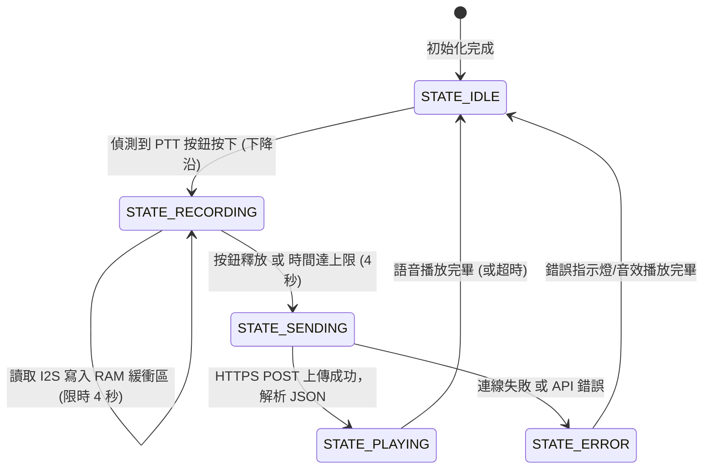

# 節點一：語音尋物與多媒體互動站 (ESP32 #1) 實作開發細則

本文件專為**節點一 (ESP32 #1)** 語音尋物與多媒體互動站的實作所規劃，涵蓋硬體腳位接線、邊緣端音訊錄製與上傳、BFF 互動通訊協定、視覺與音訊回饋，以及邊緣端的記憶體與效能優化策略。

---

## 1. 硬體架構與腳位配置 (Hardware Pins Layout)

為了實現高精確度的語音採集與清晰的語音播報，ESP32 將同時透過 **I2S (Inter-IC Sound)** 協定驅動數位輸入麥克風與數位功率放大器。

### 📌 實體接線對照表

| 外接模組 | 模組引腳 | ESP32 引腳 (推薦) | 說明 |
| :--- | :--- | :--- | :--- |
| **INMP441**<br>(I2S 麥克風) | VDD | 3.3V | 數位音訊輸入供電 |
| | GND | GND | 地線 |
| | L/R | GND | 設為低電位，代表採集左聲道音訊 |
| | WS | GPIO 15 | Word Select (訊號狀態/左右聲道切換) |
| | SCK | GPIO 14 | Serial Clock (時脈訊號) |
| | SD | GPIO 32 | Serial Data (二進制音訊數據輸出) |
| **MAX98357A**<br>(I2S 音訊放大器) | Vin | 5V (或 3.3V) | 建議接 5V 以獲得更高的喇叭驅動功率 |
| | GND | GND | 地線 |
| | LRC | GPIO 25 | Left/Right Clock |
| | BCLK | GPIO 26 | Bit Clock |
| | DIN | GPIO 22 | Data In |
| | GAIN | GND / 懸空 | 增益設定 (預設懸空即可) |
| **WS2812B**<br>(尋址燈條 x3) | VCC | 5V (外部電源) | 燈條數量較多時，強烈建議使用外部 5V 獨立供電，並共地 |
| | GND | GND | 必須與 ESP32 共地 |
| | DIN 1 | GPIO 12 | 控制第一組櫃位/燈條 (對應 `CabinetLayout` 的 Pin_12) |
| | DIN 2 | GPIO 13 | 控制第二組櫃位/燈條 (對應 `CabinetLayout` 的 Pin_13) |
| | DIN 3 | GPIO 14 | 控制第三組櫃位/燈條 (對應 `CabinetLayout` 的 Pin_14) |
| **PTT 按鈕** | OUT | GPIO 4 (Pull-Up) | 實體尋物觸發按鍵 (Push-to-Talk) |
| **狀態 LED** | + | GPIO 2 | 本地狀態指示燈 (錄音中/發送中快閃) |

> [!WARNING]
> **供電干擾防護 (Anti-Noise Tip)：** MAX98357A 與小喇叭在播放音訊時瞬間電流較大，若與 INMP441 共享 ESP32 的 3.3V 供電，極易引入高頻雜音或爆音。建議 **MAX98357A 採用 5V 供電**，並且在 5V/3.3V 電源與 GND 之間並聯一個 100uF - 220uF 的電解電容以穩定電壓。

---

## 2. 邊緣端狀態機設計 (State Machine Logic)

ESP32 韌體採用非阻塞的狀態機架構，以確保音訊串流與 LED 微動畫能流暢同步：



### 狀態變數與暫態定義
* `STATE_IDLE`：呼吸燈效果緩慢閃爍，等待使用者按下 PTT。
* `STATE_RECORDING`：本地狀態指示燈常亮，I2S 開始以 16kHz, 16-bit, Mono 模式錄音。
* `STATE_SENDING`：本地指示燈快速閃爍，ESP32 包裝 WAV Header 並以 `multipart/form-data` 通過 HTTPS 發送至 BFF。
* `STATE_PLAYING`：點亮對應櫃位的 WS2812B 導引燈（以呼吸流光效果顯示），同時解碼播放 BFF 回傳的 Base64 語音數據。

---

## 3. BFF API 通訊協定規範

ESP32 必須向 BFF 端點 `POST /api/iot/voice` 發送語音封包。

### 3.1 Request 規格
* **Method:** `POST`
* **Headers:**
  ```http
  Authorization: Bearer <IOT_BEARER_TOKEN>
  Content-Type: multipart/form-data
  ```
* **Payload (Form Data):**
  * `file`: `voiceInteract.wav` (二進制 WAV 檔案，16kHz, 16-bit, Mono)

### 3.2 Response 規格

#### 🟢 成功定位時 (HTTP 200)
```json
{
  "success": true,
  "text": "幫我找步進馬達",
  "boxId": "BOX-001",
  "location": "C1-L1-A",
  "ledAction": {
    "ledPin": "Pin_12"
  },
  "audioBase64": "//NIxAAAAAAAAAAAA..."
}
```

#### 🔴 定位失敗 / 找不到器材時 (HTTP 200 或 404)
> [!TIP]
> **獨家優化方案：** 為了避免 ESP32 在搜尋失敗時無法給予語音提示，我們建議 BFF 後端不論成功或失敗，皆使用 TTS 產生語音。若搜尋失敗，`success` 為 `false`，但依然附帶一段 `audioBase64`（例如："找不到您要的器材，請再試一次"），讓 ESP32 統一播放邏輯。

```json
{
  "success": false,
  "text": "找一個不存在的東西",
  "message": "無法定位該器材：找不到含有「不存在的東西」的在庫器材箱",
  "action": "error",
  "audioBase64": "//NIxFAILED_TTS_AUDIO..."
}
```

---

## 4. 邊緣端音訊處理：WAV 錄音與編碼實作

### 4.1 WAV Header 結構與緩衝區計算
16kHz, 16-bit, Mono 的音訊傳輸規格下：
* 每秒資料量 = $16000 \text{ Hz} \times 2 \text{ bytes (16-bit)} \times 1 \text{ 聲道} = 32,000 \text{ bytes} \approx 31.25 \text{ KB/s}$
* 限制最大錄音長度為 **4 秒**，則最大 PCM 資料量為 $128,000 \text{ bytes}$。
* ESP32 的可用 Heap 空間約有 180KB - 250KB，分配合理的 $128 \text{ KB}$ 連續靜態緩衝區是可行的。若有 PSRAM 則無限制。

WAV 檔案頭共 **44 位元組**，錄音結束後，必須在 PCM 資料前補齊以下欄位：

```cpp
struct WavHeader {
  char chunkID[4] = {'R', 'I', 'F', 'F'};
  uint32_t chunkSize;       // 整個檔案大小 - 8
  char format[4] = {'W', 'A', 'V', 'E'};
  char subchunk1ID[4] = {'f', 'm', 't', ' '};
  uint32_t subchunk1Size = 16;
  uint16_t audioFormat = 1; // PCM = 1
  uint16_t numChannels = 1; // Mono = 1
  uint32_t sampleRate = 16000;
  uint32_t byteRate = 32000;
  uint16_t blockAlign = 2;  // numChannels * bitsPerSample/8
  uint16_t bitsPerSample = 16;
  char subchunk2ID[4] = {'d', 'a', 't', 'a'};
  uint32_t subchunk2Size;   // PCM 數據總大小
};
```

### 4.2 I2S 錄音核心代碼 (Arduino / ESP-IDF)

```cpp
#include <driver/i2s.h>

#define I2S_WS_PIN 15
#define I2S_SCK_PIN 14
#define I2S_SD_PIN 32
#define RECORD_TIME_LIMIT 4 // 4秒
#define SAMPLE_RATE 16000
#define BUFFER_SIZE (SAMPLE_RATE * 2 * RECORD_TIME_LIMIT) // 128KB

uint8_t* wavBuffer = nullptr;
uint32_t pcmDataSize = 0;

void initI2SMic() {
  i2s_config_t i2s_config = {
    .mode = (i2s_mode_t)(I2S_MODE_MASTER | I2S_MODE_RX),
    .sample_rate = SAMPLE_RATE,
    .bits_per_sample = I2S_BITS_PER_SAMPLE_16BIT,
    .channel_format = I2S_CHANNEL_FMT_ONLY_LEFT, // INMP441 L/R 接地
    .communication_format = I2S_COMM_FORMAT_STAND_I2S,
    .intr_alloc_flags = ESP_INTR_FLAG_LEVEL1,
    .dma_buf_count = 8,
    .dma_buf_len = 64,
    .use_apll = false
  };

  i2s_pin_config_t pin_config = {
    .bck_io_num = I2S_SCK_PIN,
    .ws_io_num = I2S_WS_PIN,
    .data_out_num = I2S_PIN_NO_CHANGE,
    .data_in_num = I2S_SD_PIN
  };

  i2s_driver_install(I2S_NUM_0, &i2s_config, 0, NULL);
  i2s_set_pin(I2S_NUM_0, &pin_config);
}

void startRecording() {
  if (wavBuffer == nullptr) {
    wavBuffer = (uint8_t*)malloc(BUFFER_SIZE + 44); // 預留 44 bytes 給 WAV Header
  }
  pcmDataSize = 0;
  
  // 跳過錄音初期的直流雜訊 (100ms)
  size_t bytesRead = 0;
  uint8_t tempBuf[512];
  for (int i = 0; i < 10; i++) {
    i2s_read(I2S_NUM_0, tempBuf, 512, &bytesRead, portMAX_DELAY);
  }

  Serial.println(">>> 開始錄音...");
  unsigned long startMillis = millis();
  
  while (pcmDataSize < BUFFER_SIZE) {
    // 檢查按鈕是否釋放 (PTT 邏輯)
    if (digitalRead(BUTTON_PIN) == HIGH) {
      break; 
    }

    size_t readLen = 0;
    // 每次讀取 1024 bytes 並寫入緩衝區 (偏移 44 bytes 後開始儲存 PCM)
    esp_err_t err = i2s_read(I2S_NUM_0, 
                             (char*)(wavBuffer + 44 + pcmDataSize), 
                             1024, 
                             &readLen, 
                             100 / portTICK_RATE_MS);
    
    if (err == ESP_OK && readLen > 0) {
      pcmDataSize += readLen;
    }
  }
  
  Serial.printf(">>> 錄音結束，共錄製 %d bytes\n", pcmDataSize);
  
  // 寫入 44 位元組的 WAV 檔頭
  WavHeader header;
  header.chunkSize = pcmDataSize + 36;
  header.subchunk2Size = pcmDataSize;
  memcpy(wavBuffer, &header, 44);
}
```

---

## 5. 語音播放與 Base64 解碼 (I2S DAC)

BFF 會回傳含有 `audioBase64` 的 JSON 欄位（音訊通常為 **MP3** 格式以壓縮頻寬，或者是 **WAV**）。

### 📌 最佳實踐與優化解決方案：記憶體與串流
在 RAM 有限的 ESP32 上，直接使用 `ArduinoJson` 解析包含 150KB Base64 音訊的巨大 JSON 會導致頻繁的 **OOM (Out Of Memory)**。

#### 💡 解決方案 A：分塊 Base64 解碼與寫入本地 Flash SPIFFS / LittleFS
1. 接收 HTTPS 響應時，不一次性讀入整個 Body。
2. 使用自訂的 Stream Parser，邊讀取網路串流、邊尋找 `"audioBase64"` 的標籤。
3. 一旦進入 Base64 欄位，啟動邊緣解碼器，以 **Chunked 方式（如每次 128 bytes）** 邊下載邊將 Base64 解碼為原始 MP3 二進制數據，寫入本地的 Flash (SPIFFS/LittleFS)。
4. 下載完畢後，使用 `ESP32-audioI2S` 函式庫，直接讀取本地 Flash 檔案 `play.mp3` 進行 I2S 播放：
   ```cpp
   audio.connecttoFS(SPIFFS, "/play.mp3");
   ```
5. **優勢：** 記憶體消耗極低，只需數 KB 的 Buffer，完全避免記憶體崩潰。

#### 💡 解決方案 B：BFF 改採 URL 串流（未來擴充推薦）
若要進一步優化硬體體驗，可修改 BFF：
1. BFF 產生音訊後，將檔案存入公開的 CDN / 暫存空間。
2. JSON Response 僅回傳該音訊的 URL，例如：`"audioUrl": "https://cdn.rrc.ntust.edu.tw/temp/audio_123.mp3"`。
3. ESP32 取得 URL 後，直接調用 `audio.connecttohost(audioUrl)`。
4. **優勢：** ESP32 無須承擔 Base64 解碼的 CPU 運算負載，且支援即時邊下載邊播放 (Buffering)。

---

## 6. WS2812B 視覺指引控制實作

### 6.1 LED 控制架構：多通道獨立 vs 串聯單通道 Offset
系統需要根據 API 回傳的 `ledAction.ledPin` 點亮對應位置。

#### 方案 A：多通道獨立引腳控制（對應當前 CabinetLayout 設計）
* **硬體連線：** 每一層或櫃的 WS2812B 訊號線 (DIN) 分別接在 ESP32 的不同 GPIO（例如 Pin 12, Pin 13）。
* **韌體邏輯：**
  ```cpp
  #include <Adafruit_NeoPixel.h>
  
  Adafruit_NeoPixel strip1(30, 12, NEO_GRB + NEO_KHZ800);
  Adafruit_NeoPixel strip2(30, 13, NEO_GRB + NEO_KHZ800);
  
  void lightUpCabinet(String ledPin) {
    if (ledPin == "Pin_12") {
      runLedEffect(strip1);
    } else if (ledPin == "Pin_13") {
      runLedEffect(strip2);
    }
  }
  ```

#### 方案 B：串聯單引腳 Offset 尋址控制（強烈推薦：未來節省 ESP32 引腳）
* **硬體連線：** 所有櫃位的燈條首尾相連成一條長燈條，只用單一 GPIO (如 GPIO 12) 驅動。
* **韌體邏輯：** `CabinetLayout` 工作表中，將 `LED腳位` 改為儲存 `燈號區段`（例如 `0-29` 代表第一格，`30-59` 代表第二格）。
* **優勢：** 節省極為珍貴的 ESP32 GPIO 引腳，櫃位擴充性極高。

### 6.2 💡 微互動與視覺特效 (WOW Effects)
為了營造極佳的科技感與尊榮感，不應使用單調的死亮燈號。應在 `runLedEffect` 中實作以下微動畫：

1. **尋物定位成功 (流光呼吸燈)：** 對應櫃位的 LED 以綠色或藍色進行漸進式呼吸 (`brightness` 在 50 到 255 之間正弦變動)，或以彩虹跑馬燈流動，指引效果極強。
2. **錄音中狀態 (溫暖紅光淡入淡出)：** 按下 PTT 時，麥克風站本地的環狀 LED 呈現紅色呼吸特效。
3. **雲端運算中 (藍色旋轉流光)：** 發送語音封包至 BFF 時，LED 呈現藍色旋轉或快速跑馬燈，暗示系統正在「動腦思考」。
4. **錯誤狀態 (紅光快速閃爍 3 次)：** 找不到器材時，LED 紅色閃爍，配合喇叭發出「嗶嗶嗶」警告音。

---

## 7. 階段性開發任務 (TODO List)

以下是開發「節點一」的具體任務清單：

- [ ] **1. 硬體實驗板搭建與電路驗證**
  - [ ] 麵包板連接 ESP32、INMP441 與 MAX98357A
  - [ ] 加入穩壓電容，測試 I2S 基本錄音與播放，排除高頻雜音
- [ ] **2. 基礎韌體架構開發 (Arduino / PlatformIO)**
  - [ ] 實作非阻塞的狀態機，連接 WiFi 並讀取本地 `.env` 的 Token 配置
  - [ ] 實作 PTT 實體按鈕中斷觸發與防抖
- [ ] **3. I2S 錄音與 WAV 格式化**
  - [ ] 寫入 PCM 數據至靜態快取
  - [ ] 於頭部塞入 44-byte WAV 標頭，並在 Serial 輸出驗證檔案完整性
- [ ] **4. HTTPS 上傳與 BFF 對接**
  - [ ] 實作 `multipart/form-data` Post 請求發送器
  - [ ] 解析 BFF 回傳的 JSON，提取 `audioBase64` 與 `ledPin`
- [ ] **5. 音訊解碼與 I2S 播放 (難點突破)**
  - [ ] 使用 `ESP32-audioI2S` 搭配 LittleFS/SPIFFS 進行分塊 Base64 解碼寫入
  - [ ] 測試播放解碼後的語音 MP3，調整 MAX98357A 增益避免破音
- [ ] **6. LED 控制與視覺效果整合**
  - [ ] 實作 `FastLED` 呼吸燈與思考中流光效果
  - [ ] 與語音播放時間同步，點亮對應櫃位，完成語音尋物完整閉環
- [ ] **7. 整體聯調測試與優化**
  - [ ] 測試各種器材模糊關鍵字的辨識度 (由 BFF Groq Whisper 保障)
  - [ ] 優化錄音動態範圍，保證社辦環境吵雜時的搜尋準確度

---

### 💡 額外建議：BFF 音訊格式優化

在 BFF 端點 `route.ts` 中，預設使用的是 **Google Translate TTS** 作為備份，其回傳的音訊格式為 **MPEG-1 Audio Layer 3 (MP3)**。這對 `ESP32-audioI2S` 是非常友好的，因為該函式庫有高度優化的軟體 MP3 解碼器。
但請注意，如果未來將 OpenAI TTS 或 Google TTS 回傳的格式更改為原始 **WAV** 或 **AAC**，ESP32 端的解碼程式碼需要隨之調整。建議在 BFF 端將音訊格式**固定統一輸出為 MP3**，以獲得最小的網路傳輸體積與最佳的 ESP32 解碼相容性。
