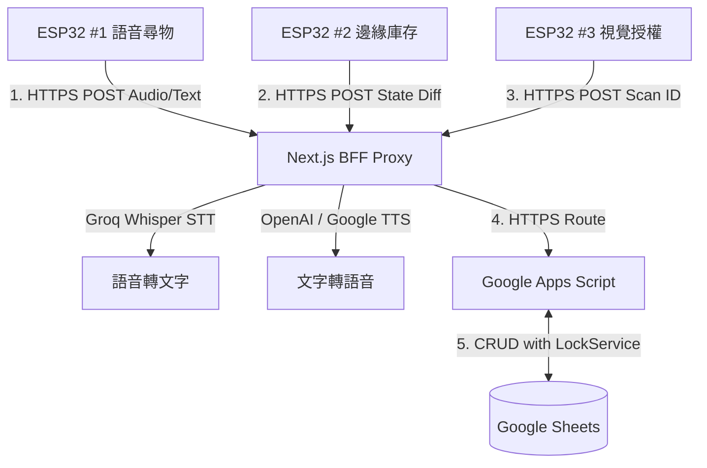
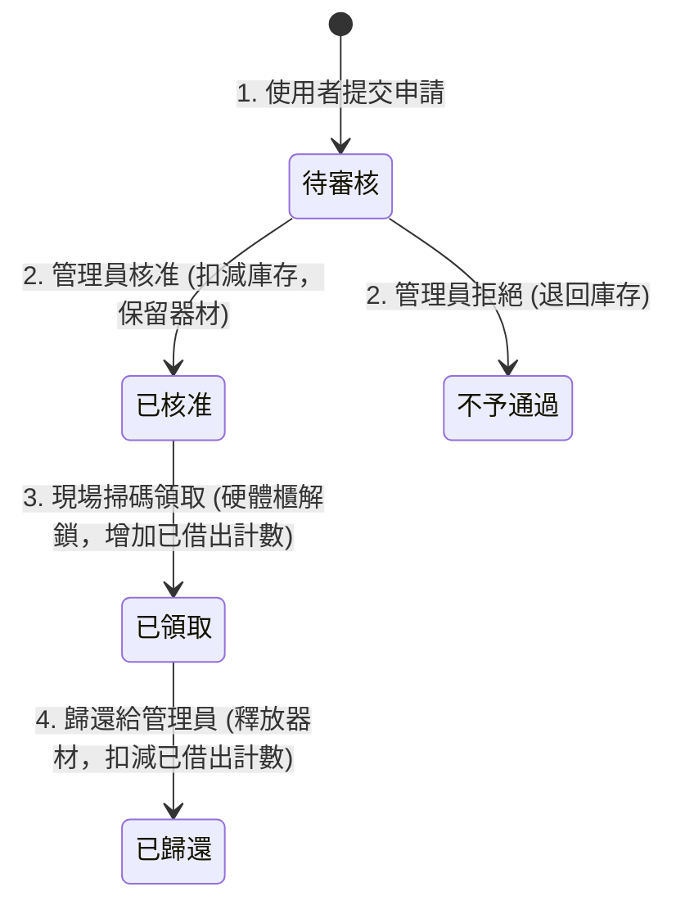

# NTUST RRC 器材資源管理系統 - IoT 延伸功能與實作開發細則 (Details_IoT.md)

本文件詳列台科大機器人研究社（NTUST RRC）社團網站新增的 IoT 自動化硬體節點延伸功能，涵蓋網頁端（Next.js Frontend / Admin Dashboard）、BFF 中介層（Next.js API Routes）、API 端（Google Apps Script Backend）以及實體硬體與資料庫（Google Sheets）之間的互動架構、功能清單與實作細則。

---

## 1. 系統架構與通訊拓撲

系統採用 **Client-Server 網域主動請求架構**。硬體端不架設伺服器，由 ESP32 作為 HTTPS Client 主動向 Next.js BFF (Vercel) 發送請求；Next.js BFF 提供安全認證、AI 語音/文字轉換，並將核心資料邏輯以 `route` 路由參數轉發至 GAS 進行試算表讀寫（搭載 LockService 鎖定機制）。

### 📌 關鍵硬體設計決策：RFID 邊緣端硬解碼
* **設計方案：** **實體箱子（Box）與 RFID UID 的對應關係直接寫死（Hardcoded）在 ESP32 韌體中。**
* **優勢效益：**
  1. **降低雲端運算負載：** ESP32 讀取到 RFID UID 後，在邊緣端直接查表轉換為 `BOX-001` 等箱子 ID，上報時直接傳遞箱子 ID，GAS 端無須再維護一張龐大的 UID 對照表。
  2. **簡化資料庫結構：** `BoxList` 只需要存儲有意義的 `箱子編號`（主鍵），不需開闢欄位存放硬體 UID，讓資料庫結構更簡潔、好維護。

---

## 2. 器材借用全新狀態流 (Equipment Borrowing Status Flow)

為了支持智能硬件櫃無人領取，本系統將借用流程升級為 **4 階段狀態機**：

1. **使用者提出申請：** 
   * 申請單 (Sheet 7) 狀態設為 `"待審核"`。
   * 器材明細 (Sheet 6) 狀態設為 `"審核中"`。
   * 器材總表 (Sheet 5) 的 `可借用` 數量 `-qty`。
2. **管理員審核通過：** 
   * 申請單 (Sheet 7) 狀態改為 `"已核准"`。
   * 器材明細 (Sheet 6) 狀態改為 `"已核准"`。
   * *(注意：此時尚未增加 Sheet 5 的已借出數量，僅處於保留狀態)*。
3. **現場自主掃碼領取：** 
   * 使用者至社辦展示 QR Code 掃描，經 OLED 明細核對並按下實體確認按鈕。
   * 申請單 (Sheet 7) 狀態改為 `"已領取"`。
   * 器材明細 (Sheet 6) 狀態改為 `"已領取"`。
   * 器材總表 (Sheet 5) 的 `已借出` 數量 `+qty`（此時完成真正的實體借出變更）。
4. **歸還器材：** 
   * 管理員確認收到歸還器材，手動在管理後台點選「歸還」。
   * 申請單 (Sheet 7) 狀態改為 `"已歸還"`。
   * 器材明細 (Sheet 6) 使用情形改為 `"可借用"`，並自動更新盤點狀態。
   * 器材總表 (Sheet 5) 的 `可借用` 數量 `+qty`，且 `已借出` 數量 `-qty`。

---

## 3. 資料庫工作表設計 (Google Sheets Schema)

在原有的系統資料表基礎上，**新增 2 張核心工作表**，並已於 `Config.js` 中完成對照。

### 3.1 箱子總表 (BoxList)
* **目的：** 儲存實體箱子資訊、所屬類別與當前的物理位置。
* **資料欄位：**
  | 索引 (Index) | 欄位名稱 | 資料類型 | 說明 | 範例 |
  | :--- | :--- | :--- | :--- | :--- |
  | 0 | 箱子編號 | String (Key) | 實體箱子唯一代碼，由 ESP32 內部硬編碼對照表直接轉換輸出 | `BOX-001` |
  | 1 | 大小 | String | 尺寸規格：`Small` (單格) 或 `Large` (雙格，佔用連續兩格) | `Large` |
  | 2 | 類別 | String | 箱內器材種類（以半形逗號 `,` 分隔），供 AI 模糊語意匹配 | `馬達, 齒輪` |
  | 3 | 位置 | String | 當前實體櫃位編號（未偵測到時為 `未偵測`） | `C1-L1-A` |
  | 4 | 狀態 | String | 箱子的在庫動態（`在櫃`、`使用中`） | `在櫃` |

### 3.2 實體櫃位映射表 (CabinetLayout)
* **目的：** 將櫃子的三維物理空間（櫃、層、格）映射到特定的 ESP32 控制引腳與語音導引描述，以達成硬體與空間的完全解耦。
* **資料欄位：**
  | 索引 (Index) | 欄位名稱 | 資料類型 | 說明 | 範例 |
  | :--- | :--- | :--- | :--- | :--- |
  | 0 | 櫃位編號 | String (Key) | 物理櫃位主鍵 | `C1-L1-A` |
  | 1 | 櫃位 | String | 實體櫃體編號 | `C1` |
  | 2 | 層 | String | 層架層數 | `L1` |
  | 3 | 位置 | String | 層內位置格（`A` 為底層、`B` 為中層、`C` 為頂層） | `A` |
  | 4 | 裝置編號 | String | 負責該區域的實體 ESP32 晶片識別碼 | `ESP32_C1_L1` |
  | 5 | LED腳位 | String | 控制該位置尋址燈條（WS2812B）的 GPIO 引腳編號 | `Pin_12` |
  | 6 | 語音描述 | String | 物理空間的中文描述，用於雲端 TTS 合成語音導引 | `第一櫃第一層底層` |

---

## 4. API 端需實現之功能 (GAS Backend & BFF Proxy)

### 4.1 GAS 後端介面端點 (Google Apps Script)

GAS 端所有控制器位於 `gas-backend/modules/iot`，已提供 5 個核心端點並註冊於 `Main.js` 路由：

#### 1. 邊緣庫存狀態變更上傳 (`POST /iot/inventory/update`)
* **功能邏輯：**
  * 解析硬體上報的 `device_id` 與實體插槽 `slots`。
  * **Large 箱子覆蓋遮擋演算法 (Large Box Overlap Guard)：** 
    * 若偵測到尺寸為 `Large` 且位於 A 層的箱子時，系統邏輯自動在 slotOccupation 中鎖定 B 層（以 `BOX-001 (Large-Blocked)` 標記），避免被空置偵測誤判。
  * 比對資料庫，將本應在此裝置管轄下卻未出現在新快照中的箱子狀態變更為 `未偵測`，並將在庫狀態改為 `使用中`。
  * 更新 `BoxList` 試算表。

#### 2. 獲取實體櫃位映射配置 (`GET /iot/cabinet/layout`)
* **功能邏輯：** 讀取 `CabinetLayout` 工作表，格式化為 JSON 陣列回傳給調用端。

#### 3. 語意關鍵字尋物定位 (`GET /iot/search/voice`)
* **功能邏輯：**
  * 根據輸入的 `keyword`（如："馬達"）與 `BoxList` 中的 `categories` 進行模糊語意比對。
  * 篩選狀態為 `在櫃` 的箱子，並關聯 `CabinetLayout` 取得其 LED GPIO 引腳及語音播報描述。
  * 回傳定位結果與控制指令。

#### 4. 視覺驗證與借用單明細讀取 (`POST /iot/auth/scan`)
* **功能邏輯：**
  * 以 `reqId` 檢索 `EquipmentApplications`（器材借用申請表）。
  * 驗證該申請單狀態是否為 `"已核准"`。
  * 回傳申請人姓名、器材摘要說明及器材明細清單，供 ESP32 OLED 螢幕顯示。

#### 5. 實體領取確認交易 (`POST /iot/auth/confirm`)
* **功能邏輯：**
  * 進入 LockService 鎖定，避免併發寫入衝突。
  * 更新 `EquipmentApplications` 的狀態為 `"已領取"`（從原有的 "已借出" 升級）。
  * 遍歷 `EquipmentDetails` 表，將該申請單關聯的所有器材項目狀態變更為 `"已領取"`。
  * **動態更新統計計數：** 讀取原始申請單中的器材清單 JSON，透過 `EquipmentRepository` 批次增加 `EquipmentIndex` (Sheet 5) 表中對應器材的 `已借出` (borrowedCount) 數量。
  * 釋放鎖定，傳送領取確認 Email。

---

### 4.2 Next.js BFF 中介層 (Next.js BFF Routes)

BFF 扮演安全過濾網關與 AI 排程中心的角色。

#### 1. 萬用轉發中介層 (`frontend/src/app/api/[...path]/route.ts`)
* **功能邏輯：** 自動轉發未註冊的 API 請求至 GAS。同時在此驗證硬體 Bearer Token `Authorization: Bearer <TOKEN>`，阻止未授權的外部偽造請求直連 GAS。

#### 2. 語音處理端點 (`frontend/src/app/api/iot/voice/route.ts`)
* **技術棧：** **Groq SDK (Whisper-large-v3-turbo) + OpenAI TTS / Google TTS 雙引擎**
* **功能邏輯：**
  * 驗證硬體 Bearer Token。
  * **語音轉文字 (STT)：** 接收硬體上傳的 `.wav` 二進制音訊檔，呼叫 **Groq Whisper API**，轉譯為中文關鍵字。
  * **櫃位查詢：** 將文字作為 `keyword` 參數請求 GAS `/iot/search/voice` 獲取定位。
  * **文字轉語音 (TTS)：** 將定位結果呼叫 OpenAI TTS 引擎（或免 Key Google Translate TTS）生成語音，並轉為 Base64 格式。
  * **回傳：** 回傳整合控制 JSON（含識別文字、櫃位、LED 腳位與語音 Base64）給 ESP32 #1 播放。

---

## 5. 網頁管理端需實現之功能 (Next.js Web Admin Dashboard)

### 5.1 審核後台狀態流對齊 (`frontend/src/app/admin/equipment/page.tsx`)
* **列表 Tab 篩選：** `"active" (借用中)` 篩選條件擴充為 `app.status === "已核准" || app.status === "已領取"`，確保審核通過待領取、以及已領取使用中的申請單皆能完美收納。
* **狀態 Badge：** 新增 `"已領取"` 專屬的亮藍色視覺狀態標記 (`bg-blue-500 hover:bg-blue-600`)，以和 `"已核准"` 的綠色及 `"待審核"` 的黃色區隔，呈現高對比度的清晰介面。
* **歸還按鈕：** 將原本只對「已核准」顯示的「歸還」按鈕，改為對 `"已領取"` 顯示（並對 `"已核准"` 保留手動覆蓋選項，作為現場硬體離線時管理員手動歸還的 Fallback 機制）。

### 5.2 器材櫃即時狀態視覺化面板 (`/admin/iot/cabinet`) - **待實作**
* **功能描述：** 建立一個響應式網格（Grid Layout），以 2D 視覺化結構模擬物理櫃子的空間結構（C1, C2 等櫃位）。

### 5.3 實體箱子與 RFID 綁定管理器 (`/admin/iot/boxes`) - **待實作**
* **功能描述：** 提供管理員登錄、編輯、刪除實體箱子配置的介面。

---

## 6. 代碼優化與正確性驗證

### 6.1 GAS 後端邏輯更正完畢
* **核准端：** `EquipmentAppService.js` 的同意申請動作，現已將 `Sheet 6` 的使用狀態設為 `"已核准"`，並且在**審核通過時先不扣減已借出數量**，完美把控在庫數據的一致性。
* **領取端：** `IoTController.js` 的 `authConfirm` 動作，在用戶掃碼並按下按鈕確認領取後，會自動將申請狀態變更為 `"已領取"`、明細變更為 `"已領取"`，並且**此時才批次累加已借出 (borrowedCount) 數量**。
* **歸還端：** `EquipmentAppService.js` 的歸還動作，會動態檢測申請單是 `"已領取"`（累減已借出數）還是僅 `"已核准"`（不累減已借出數，僅釋放可借用數），保證了庫存數據的數學精準度。
