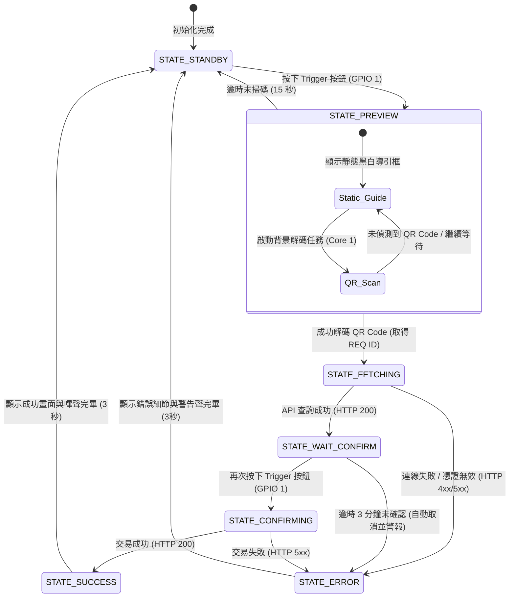

# 節點三：身分授權與視覺終端 (ESP32-S3 WROOM) 實作開發細則

本文件專為**節點三 (ESP32-S3 WROOM)** 身分授權與視覺終端之實作所規劃，涵蓋硬體腳位接線、OV2640 影像擷取與本地邊緣端 QR Code 解碼、ST7789 TFT-LCD 視覺人機介面（黑底白字設計與動態明細渲染）、BFF 安全交易通訊協定，以及邊緣端記憶體與連線優化策略。

---

## 1. 硬體架構與腳位配置 (Hardware Pins Layout)

本節點使用帶 16MB Flash + 8MB PSRAM 的 ESP32-S3 開發板。

### 實體接線對照表

#### 1.1 Camera 介面 (OV2640, 參考 CAMERA_MODEL_AI_THINKER)
OV2640 採用 8-bit 平行數據匯流排，供應電壓 DVDD_Core=1.2V，DOVDD_AVDD=2.8V。
* 核心引腳對照（AI_THINKER 配置）：
  | 鏡頭引腳 | 功能描述 | ESP32 GPIO | 備註 |
  | :--- | :--- | :--- | :--- |
  | **PWDN** | Power Down | 32 | 電源控制 |
  | **RESET** | Hardware Reset | -1 | 恆拉高或不使用 |
  | **XCLK** | System Clock | 0 | 系統時脈輸入 |
  | **SIOD** | SCCB Data (I2C SDA) | 26 | 鏡頭暫存器控制 (I2C) |
  | **SIOC** | SCCB Clock (I2C SCL) | 27 | 鏡頭暫存器控制 (I2C) |
  | **Y2 ~ Y9** | Data Bits 0 ~ 7 | 5, 18, 19, 21, 36, 39, 34, 35 | 圖像資料傳輸 (8-bit) |
  | **VSYNC** | Vertical Sync | 25 | 場同步訊號 |
  | **HREF** | Horizontal Reference | 23 | 行有效訊號 |
  | **PCLK** | Pixel Clock | 22 | 像素時脈訊號 |

#### 1.2 Premium TFT-LCD 顯示介面 (ST7789 SPI, 240x240 或 320x240)
採用 **ST7789 彩色 SPI TFT 螢幕**。螢幕全面採用**純黑底白字 (Pure Black & White) 的 UI 視覺呈現**，以提供最大對比度與高清晰度。
  | LCD 引腳 | 功能描述 | ESP32 GPIO | 備註 |
  | :--- | :--- | :--- | :--- |
  | **SDA** | SPI MOSI | 35 | 硬體 SPI 資料傳輸 |
  | **SCL** | SPI SCK | 36 | 硬體 SPI 時脈訊號 |
  | **CS** | Chip Select | 42 | LCD 片選 |
  | **DC/RS** | Data/Command Select | 41 | 暫存器/資料切換 |
  | **RST** | Reset | 37 | LCD 復位 |
  | **BLK** | Backlight Control | 47 | 可透過 PWM (LEDC) 控制螢幕亮度 |

#### 1.3 實體按鈕、狀態指示與蜂鳴器
  | 元件 | 功能描述 | ESP32 GPIO | 備註 |
  | :--- | :--- | :--- | :--- |
  | **Trigger Button** | 觸發掃碼 / 確認領取 | 1 | 外部或內部上拉，按下時為 LOW |
  | **Buzzer** | 嗶聲反饋 (Active Buzzer) | 2 | 掃描成功或錯誤時發出提示音 |

---

### Strapping Pins 安全注意須知
在硬體接線時，必須特別避開或注意以下引腳的初始電位：
1. **IO0 & IO46 (Chip Boot Mode):** 系統開機時會偵測此兩腳決定進入 Flash 還是下載模式。
   * 本專案將 **IO1** 作為按鈕腳，避開 **IO0**，防止使用者在開機時因按住按鈕導致晶片意外進入下載模式。
2. **IO45 (VDD_SPI 電壓設定):** 此引腳在開機瞬間決定 SPI 晶片的工作電壓（1.8V 或 3.3V），**絕對不可外接任何電路或上/下拉電阻**，否則會燒毀 Flash 晶片！
3. **IO3 (JTAG 訊號源):** 保持懸空，避免開機時影響晶片調試狀態。

---

## 2. 邊緣端狀態機設計 (State Machine Logic)

為了在單一 ESP32 晶片上流暢地處理「相機預覽、QR碼解碼、網路連線、LCD渲染」等高負載任務，韌體採用非阻塞（Non-blocking）事件驅動狀態機：



### 狀態細部行為定義
* `STATE_STANDBY`：螢幕進入純黑背景，僅以白色文字顯示 "請按下按鈕開始借用" 與社團 Logo 呼吸動畫。
* `STATE_PREVIEW`：啟動背景 `ESP32QRCodeReader` 掃描任務，TFT-LCD 螢幕顯示一個靜態對齊框與對焦指示文字，引導使用者將手機上的 QR 碼對準鏡頭中心，保持 15-25 公分距離。
* `STATE_FETCHING`：螢幕顯示 "正在向雲端讀取明細..." 加載動畫（純白線條與文字）。
* `STATE_WAIT_CONFIRM`：將 BFF 回傳的申請人姓名與器材明細以**純黑底白字**渲染在 LCD 上。此時指示燈慢閃，倒數計時 3 分鐘（180 秒，作為現場器材清點與領取時間），等待使用者按下實體按鈕做最終實體領取確認。
* `STATE_CONFIRMING`：發送 HTTPS POST 確定領取請求，螢幕顯示 "更新櫃位與發送通知中..."。
* `STATE_SUCCESS`：螢幕黑底白字顯示大打勾圖示與 "領取成功！"，蜂鳴器響起 "嗶－嗶－" 快音，表示櫃位已成功變更。
* `STATE_ERROR`：螢幕顯示 "錯誤！" 並以白字顯示出具體錯誤原因（例如："單號已失效"、"網路連線超時" 或 "領取逾時取消"），蜂鳴器長鳴 1.5 秒。

---

## 3. BFF 與 API 篩選邏輯規範 (Filter Logic & Specification)

在原本的網站中，「我的申請紀錄」查詢邏輯是以**使用者學號身份 (Student Identity)** 作為篩選條件，查出該學號底下的所有申請紀錄；
然而在節點三（實體領取終端）中，為了讓使用者現場掃描單一 QR Code 憑證即可進行精確領取，資料篩選邏輯必須為**以「申請編號 (reqId)」作為唯一篩選主鍵，並且強制篩選出狀態為「已核准」的器材申請**。

### 3.1 驗證與借用單明細讀取 (`POST /api/iot/auth/scan`)
* **篩選邏輯更新**：
  1. BFF 接收到掃碼的 `reqId`。
  2. 呼叫 GAS 後端（由 `IoTController.authScan` 處理），改用 `reqId` 檢索 `EquipmentApplications` 表（不依賴學生學號）。
  3. **狀態篩選 (Status Gate)**：強制檢查該 Row 的狀態欄位（Column 10）是否為 **`"已核准"`**。若為 `"待審核"`、`"已領取"`、`"已歸還"` 或 `"不予通過"`，一律直接攔截並報錯。
  4. 回傳詳細的借用清單與分配器材序號。

* **Request Headers:**
  ```http
  Authorization: Bearer <IOT_BEARER_TOKEN>
  Content-Type: application/json
  ```
* **Request Payload:**
  ```json
  {
    "reqId": "REQ-20260601-001"
  }
  ```
* **Response Payload (成功且狀態為「已核准」- HTTP 200):**
  BFF 會精準回傳與舊有網站「我的申請紀錄」中一模一樣的格式欄位。其中器材類別編號採用 `EQXXXXX` 格式（XXXXX為流水號，例如 `EQ00023`），而分配的實體編號則帶在 `allocated` 欄位中（格式為 `EQDE000XXX`，如 `EQDE000146`）：
  ```json
  {
    "success": true,
    "reqId": "REQ-20260601-001",
    "applicantName": "張家瑜",
    "status": "已核准",
    "items": [
      { "code": "EQ00001", "name": "游標卡尺", "qty": 1 },
      { "code": "EQ00008", "name": "螺絲起子組", "qty": 1 },
      { "code": "EQ00023", "name": "Arduino Uno R3", "qty": 2 }
    ],
    "allocated": [
      { "code": "EQ00001", "items": ["EQDE000111"] },
      { "code": "EQ00008", "items": ["EQDE000004"] },
      { "code": "EQ00023", "items": ["EQDE000146", "EQDE000147"] }
    ]
  }
  ```
* **Response Payload (失敗或狀態非已核准 - HTTP 400):**
  ```json
  {
    "success": false,
    "message": "申請單狀態不符: 當前狀態為 已領取"
  }
  ```

---

## 4. 邊緣端影像處理：QR Code 掃描與解碼實作

為實現零延遲的極速掃描，本專案不在雲端解析圖片，而是利用 ESP32 強大的雙核運算與 PSRAM，在**本地端直接解碼**。

本節點官方推薦基於開源庫 **`ESP32QRCodeReader`**（底層封裝了高效的 `quirc` 解碼庫，並利用 FreeRTOS 獨立線程運行在 Core 1 上），搭配 Espressif 官方的 `esp_camera` 控制。具體完整的代碼範例可直接參考專案內已附帶的兩個測試檔：
* **QR 碼掃描範例**：[Example/QR/QR.ino](file:///c:/Users/yufis/Desktop/ntust_rrc_website_IoT/Example/QR/QR.ino)
* **鏡頭相機測試範例**：[Example/Cam_test/Cam_test.ino](file:///c:/Users/yufis/Desktop/ntust_rrc_website_IoT/Example/Cam_test/Cam_test.ino)

### 雙核心多任務解碼機制
在雙核的 ESP32 架構中，為了讓 TFT-LCD 螢幕顯示與相機掃描互不卡頓，我們採用如下的多任務配置：
1. **Core 0 (主執行緒)**：負責 TFT 顯示與 UI 動態刷新、實體按鈕輪詢與狀態機流轉。
2. **Core 1 (獨立背景工作)**：使用 `ESP32QRCodeReader` 於背景常駐，設定在 Core 1，專職負責高速影像讀取與 QR Code 解碼。當解析到有效的 QR Code 時，透過 FreeRTOS 的 Queue 或回呼機制通知 Core 0。

### 開發板型號設定對照
在編譯時，可選用以下兩種內建相機配置：
* **`CAMERA_MODEL_AI_THINKER`**：適合帶有 PSRAM 的 AI-Thinker 系列開發主板（本案硬體主力，包含相機引腳與配置，如 `Cam_test.ino` 所示）。
* **`CAMERA_MODEL_ESP_EYE`**：適合常規的 ESP-EYE 測試板。

---

## 5. TFT-LCD 顯示與借用明細渲染 (Pure Black & White Design)

為了精確對齊社團內網系統的美學，**UI 全面採用純黑底白字設計，不添加任何彩色元素**。資訊呈現格式完全比照舊有網站中「我的申請紀錄」之格式展示，詳細列出每一單筆借用器材、數量與分配編號。

### 純黑白 UI 設計系統
1. **調色盤 (Color Palette):**
   * **Background (背景):** `0x0000` (`TFT_BLACK` - 純黑)
   * **Foreground/Text (前景色/文字):** `0xFFFF` (`TFT_WHITE` - 純白)
2. **格式對齊與器材編號呈現 (Website Format Alignment):**
   * **格式範本**：`[名稱] x[數量] ([分配編號，多個以逗號及空格分隔])`
   * 器材類別代碼採用 `EQXXXXX` 格式，實體分配編號採用 `EQDE000XXX` 格式
   * 範例：
     * `- 大流量真空產生器 x1 (EQDE000111)`
     * `- Raspberry Pi 3 x1 (EQDE000004)`
     * `- TT130馬達 1:48 5V x2 (EQDE000146, EQDE000147)`
   * 系統在取得 BFF 回傳的 `allocated` 與 `items` 後，會在邊緣端將對應 code 的實體分配 ID 串接，拼裝出與網頁完全相同的格式字串，呈現在 LCD 面板上。

### 3分鐘領取逾時處理機制 (3-Minute Pickup Timeout Strategy)
由於現場清點、尋找並領取器材需要時間，狀態機在 `STATE_WAIT_CONFIRM` 會給予 **3 分鐘 (180 秒)** 的寬限期，畫面會同步顯示剩餘秒數：
1. **倒數中**：螢幕顯示領取提示與剩餘秒數。使用者清點無誤後，按下實體確認按鈕即完成領取。
2. **逾時後 (Timeout Execution)**：
   * **逾時自動取消與還原**：若 3 分鐘內未按下按鈕確認，系統判定為使用者已離開或未完成領取。此時不呼叫確認 API，申請單狀態依然停留在雲端的「已核准」狀態。
   * **警告提示**：設備蜂鳴器發出 3 聲短鳴，螢幕顯示 "領取逾時！交易已自動取消。請重新掃碼。" 持續 3 秒，隨後自動返回 `STATE_STANDBY` 待機畫面。
   * **此方案優勢**：安全度高，防止未確認的器材被誤標記為「已領取」，並允許使用者直接重新掃碼再次觸發 3 分鐘領取程序。

### 借用明細純黑白介形排版
當狀態機切換至 `STATE_WAIT_CONFIRM` 時，TFT 螢幕將渲染明細資訊與倒數計時：

```
+----------------------------------------+
| [RRC IOT TERMINAL]            10:24 AM |
+----------------------------------------+
|  申請人: 張家瑜                         |
|  單  號: REQ-20260601-001              |
| -------------------------------------- |
|  待領取器材:                           |
|  - 游標卡尺 x1 (EQDE000111)            |
|  - 螺絲起子組 x1 (EQDE000004)          |
|  - Arduino Uno R3 x2 (EQDE000146, 147) |
| -------------------------------------- |
|  請在 3 分鐘內確認領取...               |
|  剩餘時間: 179 秒                      |
|  ==============□□□□□□□□ [進度條]     |
+----------------------------------------+
```

### UI 渲染與 JSON 解析範例代碼 (Pure Black & White)

```cpp
#include <TFT_eSPI.h>
#include <ArduinoJson.h>
#include <vector>

TFT_eSPI tft = TFT_eSPI();

struct BorrowedItem {
  String name;
  int qty;
  String code;
  String allocatedIds;
};

// 繪製與網頁「我的申請紀錄」完全對齊的純黑白明細畫面
void drawBorrowDetails(String applicant, String reqId, const std::vector<BorrowedItem>& items, int remainingSec) {
  tft.fillScreen(TFT_BLACK); // 純黑底
  
  // 頂部導航欄
  tft.setTextColor(TFT_WHITE);
  tft.setTextSize(1);
  tft.drawString("RRC IOT SYSTEM TERMINAL", 10, 8);
  tft.drawFastHLine(0, 24, 320, TFT_WHITE); // 純白分隔線
  
  // 畫出申請人與單號
  tft.setTextSize(2);
  tft.drawString("Applicant: " + applicant, 10, 35);
  tft.setTextSize(1);
  tft.drawString("ID: " + reqId, 10, 65);
  
  // 分隔線
  tft.drawFastHLine(10, 85, 300, TFT_WHITE);
  
  // 器材清單
  tft.drawString("EQUIPMENT LIST (APPROVED):", 10, 95);
  int yOffset = 115;
  for (const auto& item : items) {
    // 組合與網頁端相同的格式: 名稱 x數量 (編號)
    String displayLine = "- " + item.name + " x" + String(item.qty);
    if (item.allocatedIds != "") {
      displayLine += " (" + item.allocatedIds + ")";
    } else {
      displayLine += " (" + item.code + ")";
    }
    
    tft.drawString(displayLine, 15, yOffset);
    yOffset += 20;
    if (yOffset > 200) break; // 防止溢出
  }
  
  tft.drawFastHLine(10, 210, 300, TFT_WHITE);
  
  // 倒數計時與確認提示
  int barWidth = (remainingSec * 300) / 180; // 180秒倒數
  tft.drawString("Time Remaining: " + String(remainingSec) + "s", 15, 215);
  tft.drawRect(10, 225, 300, 8, TFT_WHITE);    // 純白外框
  tft.fillRect(10, 225, barWidth, 8, TFT_WHITE); // 純白填充進度條
}

// 解析 BFF JSON 格式並組裝資料結構
std::vector<BorrowedItem> parseApplicationResponse(String jsonStr, String& applicant, String& reqId) {
  std::vector<BorrowedItem> list;
  DynamicJsonDocument doc(4096);
  DeserializationError error = deserializeJson(doc, jsonStr);
  if (error) return list;
  
  applicant = doc["applicantName"].as<String>();
  reqId = doc["reqId"].as<String>();
  
  JsonArray itemsArr = doc["items"].as<JsonArray>();
  JsonArray allocArr = doc["allocated"].as<JsonArray>();
  
  for (JsonObject item : itemsArr) {
    BorrowedItem bItem;
    bItem.code = item["code"].as<String>();
    bItem.name = item["name"].as<String>();
    bItem.qty = item["qty"].as<int>();
    
    // 查找並串接分配編號 (Allocated IDs, 格式如 EQDE000XXX)
    bItem.allocatedIds = "";
    for (JsonObject alloc : allocArr) {
      if (alloc["code"].as<String>() == bItem.code) {
        JsonArray items = alloc["items"].as<JsonArray>();
        for (int i = 0; i < items.size(); i++) {
          if (i > 0) bItem.allocatedIds += ", ";
          bItem.allocatedIds += items[i].as<String>();
        }
        break;
      }
    }
    list.push_back(bItem);
  }
  return list;
}
```

---

## 6. 邊緣端可靠性與連線優化機制 (Edge Reliability & Network Optimizations)

為了在硬體配置下維持極高的系統可用性，邊緣端主要依賴 **ESP32 的 EEPROM / Preferences 本地快閃記憶體儲存** 以及 **HTTPS 即時保活重試邏輯**。

### 6.1 本地偏好設定持久化快取 (Preferences Caching)
ESP32 內建有非易失性儲存（NVS），可做為輕量級的資料快取介面：
* **應用場景**：儲存本地裝置 API Token、最近一次掃描成功的單號、與本地設定狀態。
* **NVS 範例代碼**：
```cpp
#include <Preferences.h>
Preferences preferences;

void saveLastRequest(String reqId) {
  preferences.begin("iot-config", false);
  preferences.putString("last_req", reqId);
  preferences.end();
}

String getLastRequest() {
  preferences.begin("iot-config", true);
  String lastReq = preferences.getString("last_req", "");
  preferences.end();
  return lastReq;
}
```

### 6.2 網路瞬斷自愈與連線保護機制
由於本節點屬於即時的「交易終端」，對網路要求極高：
1. **即時連線探針**：狀態機於每次按鈕按下的瞬間，優先發送一個輕量級的 TCP Ping 或 HTTPS Header 握手，確保 BFF 端點可連線後才讓鏡頭進入掃碼模式，防止使用者在斷線狀態下空等掃描。
2. **自動連線守護者 (Watchdog Connection Task)**：在背景以低優先度監控 WiFi 狀態，一旦偵測到連線斷開，自動在背景啟動重連，UI 同步在螢幕角落渲染微小斷線圖示以提醒使用者。

---

## 7. 階段性開發任務 (TODO List)

以下為開發「節點三」的具體時程與任務清單：

- [ ] **1. 邊緣端 QR 碼本地讀取與 Serial 驗證 (優先核心任務)**
  - [ ] 依電路圖在麵包板上連接 ESP32 與 OV2640 鏡頭模組，確保供電與接線正確
  - [ ] 燒錄並執行 [Example/QR_Test/QR_Test.ino](file:///c:/Users/yufis/Desktop/ntust_rrc_website_IoT/Example/QR_Test/QR_Test.ino) 測試專案
  - [ ] 開啟電腦的 Serial 監控視窗（Baud rate: 115200）
  - [ ] 拿鏡頭掃描目前社團網頁實際生成的借用憑證 QR Code（含有 REQ-YYYYMMDD-XXX 格式之單號）
  - [ ] 驗證並調整鏡頭焦距（在 15~25 公分最佳對焦範圍內），確認 Serial 視窗能精準無誤地印出解碼後的單號字串
- [ ] **2. 基礎軟體框架與狀態機搭建**
  - [ ] 撰寫主循環非阻塞狀態機，整合按鈕事件與 3 分鐘逾時倒數
  - [ ] 整合 TFT_eSPI 顯示驅動，測試 **純黑底白字 (TFT_BLACK & TFT_WHITE)** 的字體排版與 UI 靜態對齊引導框
- [ ] **3. 鏡頭背景解碼多線程整合**
  - [ ] 參考並執行 [Example/Cam_test/Cam_test.ino](file:///c:/Users/yufis/Desktop/ntust_rrc_website_IoT/Example/Cam_test/Cam_test.ino) 測試相機底層驅動與配置
  - [ ] 測試並確保 Core 1 背景 `ESP32QRCodeReader` 掃碼解碼與 Core 0 前景 TFT-LCD 黑白文字繪製互不衝突、流暢運作
- [ ] **4. BFF HTTPS 協定與網路安全串接**
  - [ ] 整合 WiFiClientSecure，加入對 Vercel SSL 憑證的支援
  - [ ] 實作 `/api/iot/auth/scan` 請求，帶入 `reqId` 連線查詢
  - [ ] **對齊網頁格式**：使用 `ArduinoJson` 解析 `items` 與 `allocated` 陣列，拼接成 `[名稱] x[數量] ([分配編號])` 格式（分類編號如 `EQ00023`，實體分配編號如 `EQDE000146`）
- [ ] **5. NVS 快取與 3分鐘逾時機制驗證**
  - [ ] 實作 NVS (`Preferences`) 本地讀寫，快取最新的單號資訊
  - [ ] 驗證在 `STATE_WAIT_CONFIRM` 逾時 3 分鐘後，自動重設為 `STATE_STANDBY` 且不觸發確認 API，並發出蜂鳴器警報聲與提示訊息
- [ ] **6. 全系統軟硬體聯調**
  - [ ] 與 Next.js 網頁管理端、GAS 進行整機連線測試，**確保只核發狀態為「已核准」的借用申請**
  - [ ] 測試實體領取後，網頁端後台是否即時更新為 "已領取"，庫存數量是否精準扣除
